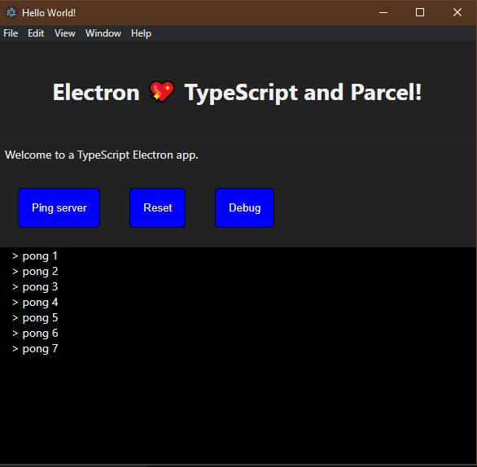

# A TypeScript Electron app using Parcel

This example demonstrate how you can set-up TypeScript and Parcel to build a fully functional electron application.

We use [elctron-forge](https://www.electronforge.io/) to assemble the Electron app.

To begin, make sure you get all the dependencies installed:

    yarn install --force

After you can run the app locally and enter in watch mode (for the front-end code).

    yarn start

This script uses `concurrently` to run `elctron-forge start` and `parcel`.

Once the app is up and running you can edit the front-end code and Parcel will rebuild and re-bundle all the frontend code in a single js file.

To actually produce the standalone distributable you can use

    yarn make

Here, we rebuild everything and then launch `electron-forge make`.
You will get the actual application native files under the `out` directory.

